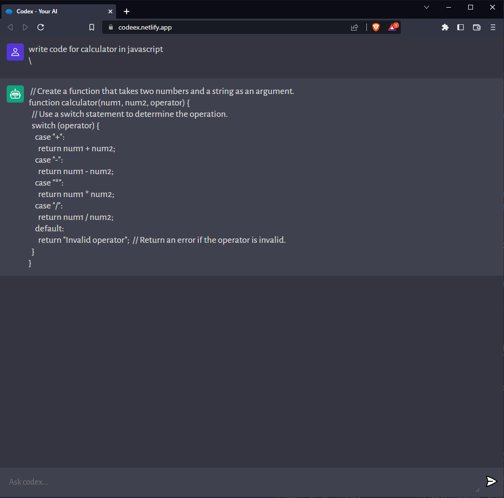

# Code-EX

### ChatGPT Clone is a web-based chatbot application that utilizes OpenAI's GPT language model to provide answers to user coding questions and queries.

**Link to project:** [https://codeex.netlify.app/]

## How It's Made:

**Tech used:** VanilaJS, Vite, HTML, CSS, OpenAI API

- Building this application gave me the knowledge on how to better understand and use the OpenAI API. I learnt how to setup a vanilla JavaScript project using Vite, NodeJS for the server side, Creating responsive layouts with pure CSS, Handle events with JavaScript, Render markdown from string, Using Prism for code highlighting, Make API requests, Catch errors, Write clean code and then deployed it online.

- Future additions could be GoogleOAuth so users could have their own generated chat logs.

- Additionally, you can further fine-tune the model by re-training it on a custom dataset. The model is built using the transformers library and pre-trained on a large corpus of text. To re-train the model, you can use the train.py script and provide your own training data.
